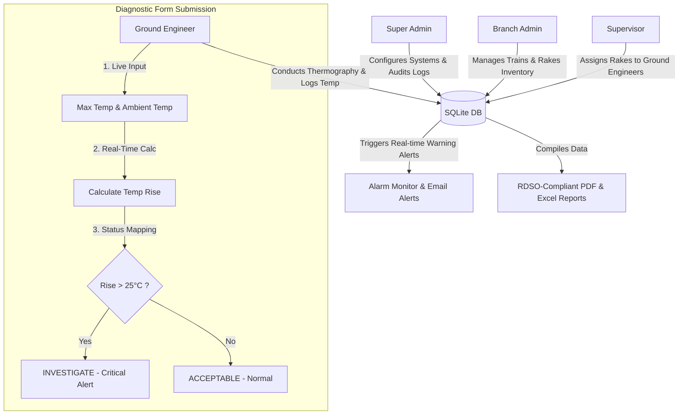

# 🚄 Bogie Thermal Inspection & Analytics Portal
## Indian Railway Automated Thermal Diagnostics & Compliance Ecosystem

[](https://opensource.org/licenses/MIT)
[-blue)](https://react.dev/)
[](https://nodejs.org/)
[-lightgrey)](https://www.sqlite.org/)
[](#)

A state-of-the-art, high-performance, enterprise-grade digital portal designed for **Indian Railways** to automate, monitor, and audit bogie thermal diagnostics. By transitioning from manual paper logs to automated thermal diagnostic logs, this platform enables field engineers to perform zero-skip sequential scans while supervisors and administrators manage breach alerts, compliance rate scoreboards, and automatically generated PDF/Excel reports.

---

## 📌 System Architecture & Flow

The system employs a strict, role-based security model guarding distinct dashboards. The following flowchart represents the transaction cycle of rake diagnostics, supervisor scheduling, ground engineers checks, and administrative audits:



---

## 🚀 Key Features

### 1. Advanced Searchable Dropdowns
- Custom-built react container dropdowns replacing native browser selectors.
- Case-insensitive on-the-fly text filtering with auto-focus inputs.
- Premium UI with selected checks (`Check` icon) and bouncy iOS transition physics (`animate-ios-spring`).

### 2. High-Fidelity Custom Calendar Modals
- Tailored React-based calendar modal that renders in the center of the screen with a smooth spring bounce.
- Month-by-month grid navigation with timezone-safe local formatting.
- Designed with high-contrast red close buttons (`X` icon with outer red borders) positioned offset from month selectors to eliminate misclicks.
- Updates the live data table to fetch reports exclusively for the clicked custom date.

### 3. Part-Wise Diagnostic Checklist Modal
- Dedicated form modal mimicking the exact structural columns of the **RDSO Automated Inspection Service Report**.
- Pre-populated default values based on rake types (**MEMU / LHB**) for speed of client demonstrations.
- Interactive layout grouped by coaches (**DMC1, TC1, TC2**) and specific components (**CRW MCB Panel, Contactor panel, Transformer, Axle Box Left/Right**).
- **Real-Time Temp Rise Calculator**: Instantly computes `Rise = Max Temp - Ambient Temp` upon keypress.
- **Dynamic Status Mapping**: Live status feedback matching the exact PDF layout text labels:
  - <span style="color: #059669; font-weight: bold;">ACCEPTABLE</span> (Green) if Rise $\le 25^\circ\text{C}$
  - <span style="color: #dc2626; font-weight: bold;">INVESTIGATE</span> (Red) if Rise $> 25^\circ\text{C}$ (forces critical alert in database)

### 4. Interactive Confirmation Overlay
- Animated secondary pop-up asking for confirmation before final logs lock and transmission.
- Displays an aggregate telemetry summary of all recorded temperatures, rises, and anomalies.

---

## 🛠️ Technology Stack

| Component | Technology | Description |
| :--- | :--- | :--- |
| **Frontend Core** | React 18 (Vite SPA) | Fast, responsive single-page architecture |
| **Styling** | Tailwind CSS | Sleek light-theme design tokens, glassmorphism overlays |
| **Animations** | CSS Keyframes + HSL Physics | Keyframe spring bouncy transitions and fade-in backdrops |
| **Icons** | Lucide React | High-contrast geometric system icons |
| **Backend API** | Node.js + Express.js | REST APIs supporting role-guards & refresh token security |
| **Database** | Native SQLite (`node:sqlite`) | High-speed transactional storage with zero setup overhead |
| **PDF Generation**| PDFKit | Conforms precisely to Indian Railways official PDF documents |
| **Excel Export** | ExcelJS | Auto-formatted spreadsheets with status color-coding |

---

## 🗄️ Database Schema Details

The application runs on an integrated SQLite engine. The schema contains 7 tables maintaining relational constraints:

### `users`
Stores system accounts with credentials and roles:
- `id` (UUID Primary Key)
- `name`, `email`, `password` (bcrypt hash), `role` (`super_admin`, `branch_admin`, `supervisor`, `ground_engineer`), `parent_id` (relates to supervisor/admin hierarchy), `division` (e.g. Mumbai, Gorakhpur)

### `trains`
Configured rakes inventory:
- `id` (UUID Primary Key)
- `train_number` (e.g. `218113 / 208272 / 218114`), `train_name` (e.g. `MEMU`), `route` (e.g. `Mumbai City Branch`)

### `coaches`
Coaches attached to trains:
- `id` (UUID Primary Key), `train_id` (Foreign Key -> trains), `name` (e.g. `DMC1`, `TC1`), `type`, `sequence_order`

### `zones`
Inspectable components inside each coach:
- `id` (UUID Primary Key), `coach_id` (Foreign Key -> coaches), `zone_name` (e.g. `CRW MCB Panel`), `zone_type` (`Electrical`, `Axle Box`), `warning_threshold` (default 70°C), `critical_threshold` (default 85°C)

### `inspection_sessions`
Inspection sessions started by Ground Engineers:
- `id` (UUID Primary Key), `train_id` (Foreign Key -> trains), `inspector_id` (Foreign Key -> users), `inspection_date` (YYYY-MM-DD), `status` (`draft`, `submitted`), `remarks`

### `thermal_readings`
Temperature logs recorded during an inspection:
- `id` (UUID Primary Key), `session_id` (Foreign Key -> sessions), `zone_id` (Foreign Key -> zones), `temperature` (Max Temp), `ambient_temperature` (Ambient Temp), `status` (`normal`, `critical`), `notes`

### `alerts`
Anomaly warnings logged upon critical rise breaches ($>25^\circ\text{C}$):
- `id` (UUID Primary Key), `zone_id` (Foreign Key -> zones), `reading_id` (Foreign Key -> readings), `session_id`, `alert_type`, `temperature`, `is_acknowledged` (boolean)

---

## ⚙️ Quick Start Installation

Follow these steps to run the complete diagnostic portal locally:

### Prerequisites
- Node.js (version 18.x or above)
- npm (version 9.x or above)

### 1. Clone & Initialize Backend
```bash
# Navigate to backend directory
cd backend

# Install dependencies
npm install

# Seed the database (generates trains, zones, supervisor relations, and 30 days of analytics logs)
npm run seed

# Run Backend Server (Starts on port 5050 with nodemon)
npm run dev
```

### 2. Initialize Frontend
```bash
# Navigate to frontend directory
cd ../frontend

# Install dependencies
npm install

# Run Frontend Dev Server (Starts Vite server on http://localhost:5173)
npm run dev
```

---

## 🔑 Demo Account Credentials

For client presentation, use the following pre-configured user credentials:

| Role | Username | Password |
| :--- | :--- | :--- |
| **Super Admin** | `admin@thermalportal.in` | `Admin@123` |
| **Branch Admin** | `branchadmin@thermalportal.in` | `Admin@123` |
| **Supervisor** | `priya.nair@thermalportal.in` | `Supervisor@123` |
| **Ground Engineer** | `suresh.patil@thermalportal.in` | `Inspector@123` |

---

## 📊 Live Reports PDF Compliance

The inspection report generated by the backend strictly prints the bogie scanning details in accordance with RDSO guidelines:
- **Zebra-Striped Data Grid** for high readability.
- **High-contrast text indicators** displaying acceptable and investigate alerts.
- **Official Metadata Card** mapping Rake Numbers, inspector names, and division branches.
